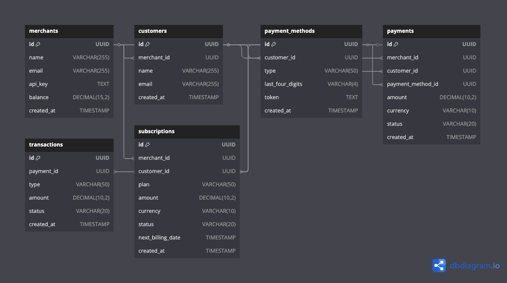

# Go-Pay: A Stripe-Like Payment Gateway

## Overview
Go-Pay is a scalable, secure, and modern payment gateway built using **Golang** and **PostgreSQL**. It follows **Hexagonal Architecture** and implements key features like merchant onboarding, customer payments, transactions, and subscriptions, making it a great fintech resume project.

## Features
- ✅ Merchant onboarding & API key management
- ✅ Customer registration & payment methods (tokenized)
- ✅ Payment intents & processing (auth + capture model)
- ✅ Transaction ledger & refunds
- ✅ Subscription & recurring billing
- ✅ Webhooks for event-driven updates
- ✅ Secure & PCI-compliant design

## Project Structure
```
go-pay/
│── cmd/                   # Application entry points
│   ├── api/               # REST/gRPC server
│   ├── worker/            # Background workers for async processing
│── config/                # Configuration files
│── internal/              # Hexagonal Core (Business Logic)
│   ├── domain/            # Core business entities
│   │   ├── merchant.go    # Merchants (Businesses using Go-Pay)
│   │   ├── customer.go    # Customers making payments
│   │   ├── payment.go     # Payment processing entity
│   │   ├── transaction.go # Transactions & ledger tracking
│   │   ├── subscription.go # Recurring payments & billing
│   ├── repository/        # Data access layer
│   ├── service/           # Business logic (Use Cases)
│── migrations/            # Database schema migrations
│── pkg/                   # Reusable utilities (encryption, tokenization, etc.)
│── scripts/               # Deployment & automation scripts
│── test/                  # Unit & integration tests
│── go.mod                 # Go module dependencies
│── Dockerfile             # Docker setup
│── README.md              # Documentation
```

## API Endpoints
### 1. Merchant API
- **POST /api/v1/merchants/register** – Register a new merchant
- **GET /api/v1/merchants/{id}** – Get merchant details

### 2. Customer API
- **POST /api/v1/customers/register** – Register a customer
- **POST /api/v1/customers/payment-methods** – Save card/bank details (Tokenized)

### 3. Payment API
- **POST /api/v1/payments/intent** – Create a payment intent (auth + capture)
- **POST /api/v1/payments/confirm** – Confirm & process a payment
- **POST /api/v1/payments/refund** – Process a refund

### 4. Transaction API
- **GET /api/v1/transactions/{id}** – Get transaction details
- **GET /api/v1/transactions/merchant/{merchant_id}** – Get all transactions for a merchant

### 5. Subscription API
- **POST /api/v1/subscriptions** – Create a subscription
- **POST /api/v1/subscriptions/cancel** – Cancel a subscription

### 6. Webhooks & Event Handling
- **POST /api/v1/webhooks/payment-success** – Notify merchants about successful payments
- **POST /api/v1/webhooks/payment-failed** – Notify merchants about failed payments

## Database Schema
Below is the **entity-relationship diagram (ERD)** representing the database schema for Go-Pay:




## Next Steps
- Implement authentication & API key security
- Add fraud detection mechanisms
- Optimize database queries for high scalability